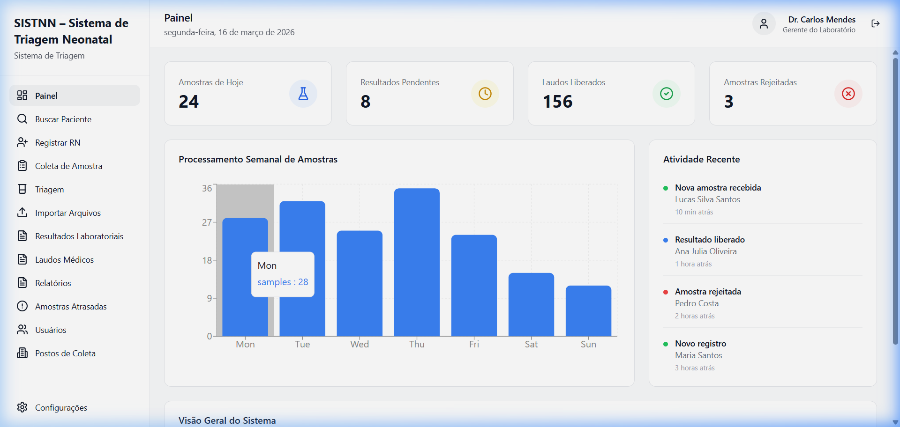
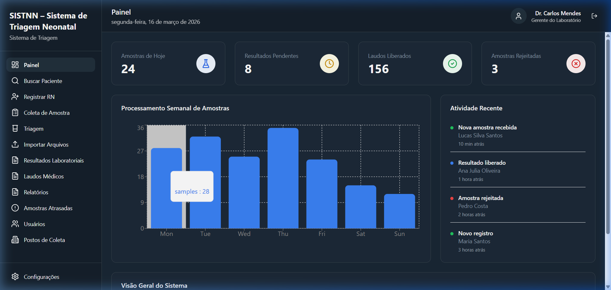
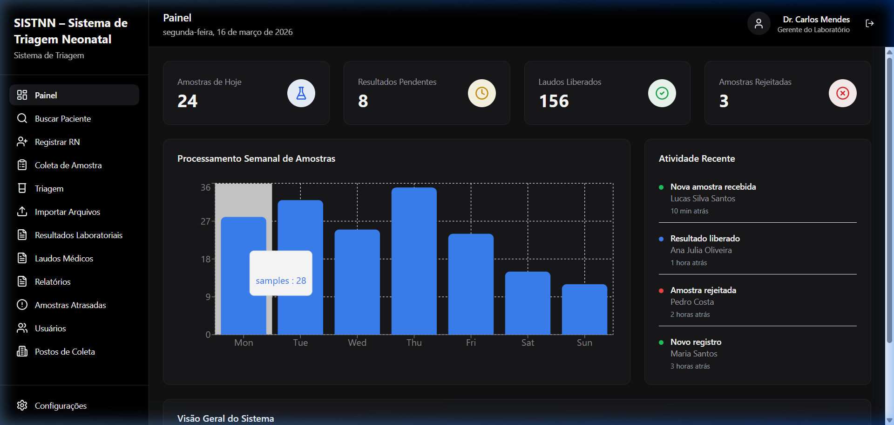

# PROTO-SISTNN (Sistema de Triagem Neonatal)

Este é o front-end (interface de usuário) do **SISTNN – Sistema de Triagem Neonatal**. A aplicação foi construída para demonstrar os fluxos de trabalho do programa de triagem neonatal, incluindo cadastro de pacientes, coleta de amostras, visualização de laudos e gestão de resultados, agora com integração a uma API Flask no back-end.

## 🛠️ Tecnologias Utilizadas

Este projeto foi gerado e é mantido com as seguintes tecnologias principais:
- **[React](https://react.dev/)** (Interface de Usuário)
- **[Vite](https://vitejs.dev/)** (Build tool e servidor de desenvolvimento)
- **[TypeScript](https://www.typescriptlang.org/)** (Tipagem estática)
- **[Tailwind CSS](https://tailwindcss.com/)** (Estilização de utilitários)
- **[React Router DOM](https://reactrouter.com/)** (Navegação/Roteamento)
- **[Lucide React](https://lucide.dev/)** (Ícones)

---

## 🚀 Como rodar o projeto localmente

Siga o passo a passo abaixo para que outro desenvolvedor consiga baixar, instalar as dependências e rodar o projeto perfeitamente:

### 1. Pré-requisitos
Certifique-se de que você tem o **[Node.js](https://nodejs.org/)** instalado (versão 18 ou superior é recomendada). A instalação do Node já inclui o gerenciador de pacotes `npm`.

### 2. Clonar o repositório
Em seu terminal, clone o projeto (caso ainda não o possua localmente):
```bash
git clone https://github.com/sauloscm/PROTO-SISTNN.git
```

### 3. Instalar depedências
Acesse a pasta do projeto (caso o repositório possua uma pasta específica, como `front-end`, entre nela) e execute o comando de instalação:
```bash
cd front-end  # (Se o projeto estiver dentro deste subdiretório)
npm install
```

### 4. Executar o servidor de desenvolvimento
Após a instalação das dependências, inicie o servidor local:
```bash
npm run dev
```

O terminal exibirá uma URL (geralmente `http://localhost:5173`). Basta segurar `Ctrl` (ou `Cmd` no Mac) e clicar no link, ou copiar e colar no seu navegador.

### 5. Build para produção (Opcional)
Se precisar gerar a versão otimizada para produção:
```bash
npm run build
```
Os arquivos minificados serão gerados na pasta `dist/`.

---

## 📂 Estrutura de Diretórios Básica

- `src/app/pages/`: Contém as telas principais do sistema (Login, Dashboard, Cadastro, Resultados, etc).
- `src/app/components/`: Componentes reutilizáveis de interface (Botões, Cards, Modais, etc).
- `src/app/data/`: Diretório contendo os mocks de dados (informações fictícias usadas no protótipo).
- `src/styles/`: Arquivos CSS globais e do Tailwind.

## 💡 Integração com Backend e Banco de Dados
Este projeto conta com integração completa a um back-end **Flask** e um banco de dados relacional.
- Os dados exibidos (pacientes, amostras, resultados) são consumidos dinamicamente de uma API RESTful.
- O sistema realiza operações CRUD (criação, leitura, atualização e exclusão) conectadas ao servidor.
- As chamadas de rede são gerenciadas através da pasta `src/services/api.ts` utilizando a biblioteca `axios`.

---

## 🎨 Temas e Experiência Visual

O sistema conta com três modos visuais distintos que podem ser alterados nas **Configurações**:

### 1. Modo Claro (Padrão)
Interface limpa com foco em legibilidade e profissionalismo.


### 2. Modo Dim (Azulado)
Inspirado na estética "navy" moderna, ideal para ambientes de baixa luminosidade sem perder a saturação de cores.


### 3. Modo Escuro
Foco total em contraste e redução de fadiga ocular, utilizando tons de preto puro e chumbo.

